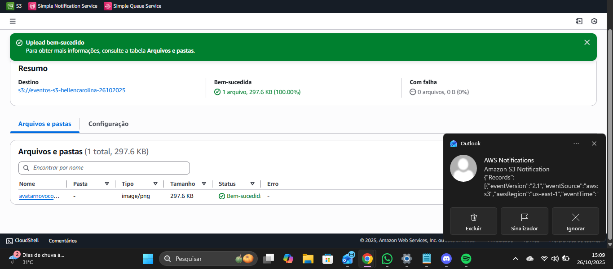

## 🔔 Laboratório: Notificações e Auditoria de Eventos S3 com SNS e SQS

**Trilha:** Solutions Architect | **Instituição:** Escola da Nuvem

### 🎯 Objetivo do Projeto

Configurar uma arquitetura de desacoplamento para monitorar e registrar eventos de Upload (`s3:ObjectCreated:*`) e Exclusão (`s3:ObjectRemoved:*`) em um bucket S3.

O objetivo foi garantir:
1.  **Notificação Imediata:** Envio de e-mail ao usuário (via SNS).
2.  **Registro Durável:** Registro do evento em uma fila SQS para processamento futuro ou auditoria.

### ⚙️ Serviços AWS Utilizados

| Serviço | Papel na Arquitetura |
| :--- | :--- |
| **Amazon S3** | Fonte dos eventos (Bucket de armazenamento). |
| **Amazon SNS** | Serviço de notificação **Fanout**. Recebe o evento do S3 e o publica para todos os assinantes (e-mail e SQS). |
| **Amazon SQS** | Fila de mensagens. Armazena o evento de forma durável para processamento posterior. |
| **IAM Policy** | Permissões de acesso para que o S3 possa publicar no SNS, e o SNS possa publicar no SQS. |

---

### 📋 Pré-Requisitos

* Conta AWS ativa com permissões para **S3, SNS e SQS**.
* Endereço de e-mail válido para confirmação da inscrição no tópico SNS.
* Região de Trabalho: **Norte da Virgínia (`us-east-1`)** para todos os recursos.

### 👣 Passo a Passo da Implementação

As etapas focam na criação dos recursos e, crucialmente, na configuração das políticas de acesso.

#### Passo 1: Criação dos Recursos Principais e ARNs

| Recurso | Nome Exemplo | Ação | ARN |
| :--- | :--- | :--- | :--- |
| **S3 Bucket** | `eventos-s3-seunome-data` | Criado na região `us-east-1`. | ✅ Copiar ARN |
| **SNS Tópico** | `notificacoes-s3-seunome-data` | Tipo Padrão. | ✅ Copiar ARN |
| **SQS Fila** | `fila-eventos-s3-seunome-data` | Tipo Padrão. | ✅ Copiar ARN |

Após a criação do Tópico SNS, foi realizada a **Criação e Confirmação da Assinatura de E-mail** (Protocolo: `E-mail`, Endpoint: `Seu Email`) clicando no link enviado pela AWS.

#### Passo 2: Configuração das Políticas de Acesso (IAM)

Esta é a etapa crítica para permitir a comunicação entre os serviços.

##### A. Política do Tópico SNS (Permitir que o S3 Publique no SNS)

A política do Tópico SNS foi editada para incluir uma declaração (`Statement`) que permite que o **serviço S3** publique mensagens (`SNS:Publish`) no tópico.

* `"Principal": {"Service": "s3.amazonaws.com"}`
* `"Action": "SNS:Publish"`
* `"Condition": {"ArnLike": {"aws:SourceArn": "ARN do Bucket S3"}}`

##### B. Política da Fila SQS (Permitir que o SNS Publique no SQS)

A política da Fila SQS foi editada para incluir uma declaração que permite que o **serviço SNS** envie mensagens (`SQS:SendMessage`) para a fila.

* `"Principal": {"Service": "sns.amazonaws.com"}`
* `"Action": "sqs:SendMessage"`
* `"Condition": {"ArnEquals": {"aws:SourceArn": "ARN do Tópico SNS"}}`

#### Passo 3: Conexão S3 ➡️ SNS

No **S3 Bucket > Propriedades > Notificações de eventos**, a seguinte notificação foi configurada:

* **Tipos de eventos:** `s3:ObjectCreated:*` e `s3:ObjectRemoved:*`
* **Destino:** Tópico do SNS (selecionando o tópico criado).

#### Passo 4: Conexão SNS ➡️ SQS (Fanout)

No **SNS Tópico > Assinaturas**, uma nova assinatura foi criada:

* **Protocolo:** `Amazon SQS`.
* **Endpoint:** ARN completo da Fila SQS.
* **Detalhe Importante:** A opção **"Habilitar conteúdo de mensagem bruta"** foi marcada para garantir que a fila receba o JSON completo do evento S3.

### ✅ Demonstração e Teste

1.  **Ação (Upload):** Um arquivo de teste foi carregado no bucket S3.
    * **Resultado Email:** Uma notificação de e-mail foi recebida (via SNS).
    * **Resultado SQS:** Uma mensagem com o evento JSON foi encontrada na fila SQS (via "Pesquisar mensagens").
2.  **Ação (Exclusão):** O arquivo foi excluído do bucket S3.
    * **Resultado Email:** Uma nova notificação de e-mail foi recebida.
    * **Resultado SQS:** Uma segunda mensagem de evento (tipo `ObjectRemoved`) foi encontrada na fila SQS.

**Conclusão do Teste:** A arquitetura desacoplada está funcionando perfeitamente, garantindo auditoria e notificação em tempo real para eventos críticos do S3.

### 🗑️ Limpeza de Recursos

Para evitar custos, os recursos devem ser removidos na seguinte ordem:

1.  Esvaziar e Excluir o **Bucket S3**.
2.  Excluir a **Fila SQS**.
3.  Excluir o **Tópico SNS** (o que também exclui suas assinaturas).

### 📊 Diagrama da Arquitetura Implementada e Imagens do Laboratório:

    

---

Espero que este passo a passo detalhado e formatado ajude você a destacar seu aprendizado no GitHub! Gostaria de adicionar ou modificar alguma seção?
